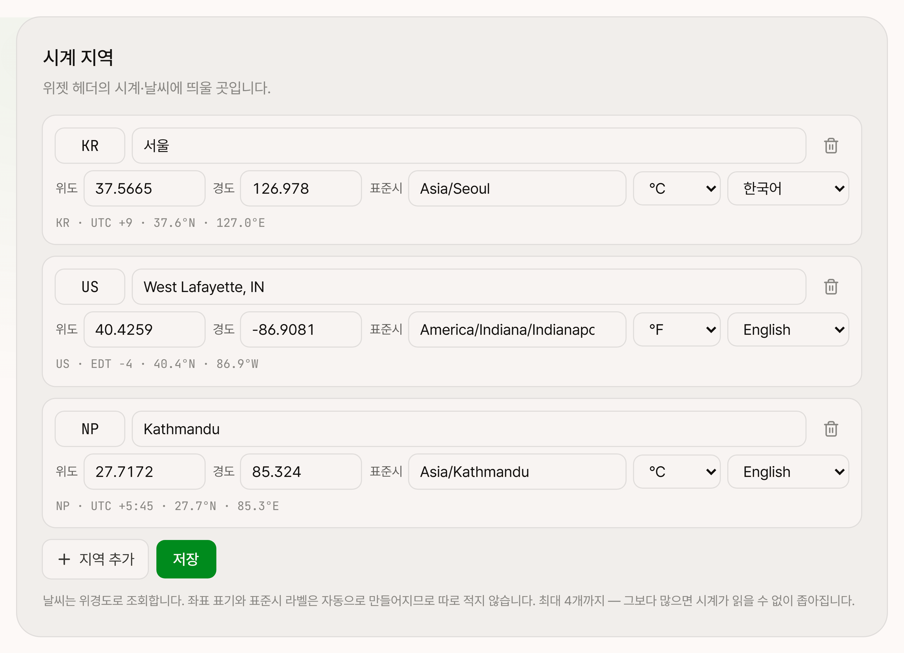

# MailBento

여러 **IMAP 메일함을 한 화면에서 동시에 보는 셀프호스팅 대시보드**입니다.
자기 서버나 NAS 에 Docker 로 올려 쓰는 개인용 앱입니다.


> 화면의 메일·계정·메모는 전부 예시용 더미 데이터입니다.

## 기능

**메일함** — IMAP 계정을 여러 개 등록해 카드로 나란히 놓습니다. 카드 머리말을 끌어 순서를
바꾸고, 읽음·표식을 앱 안에서 관리합니다.

**메일박스 뷰** — 같은 계정을 복제해 IMAP 쿼리(`folder:` / `from:` / `subject:` / `unseen` /
`since:` …)만 다르게 주면 폴더별·검색별 카드가 됩니다.

**메일 보관함** — 메일함 카드는 IMAP 이 주는 최신 N통을 비추는 창이라 메일이 지워지거나 뒤로
밀리면 다시 찾을 수 없습니다. 보관함은 고른 메일을 본문까지 **사본째** 떠 두어 원본이 서버에서
사라져도 그대로 열립니다. 순서도 직접 잡습니다.

**위젯** — 시계·날씨, 검색, 번역, 폴더 링크, 메모, 코크보드. 넓은 화면에서 2×2 로 놓입니다.

**시계 지역** — 설정에서 위경도로 최대 4곳까지 등록합니다. 좌표 표기와 표준시 라벨,
날씨 조회는 위경도와 IANA 표준시에서 자동으로 만들어집니다.



**그 밖에**

- 계정·메일박스 뷰·위젯·표시설정·보관 사본을 JSON 한 파일로 내보내고 불러옵니다
- 라이트 / 다크 × 6가지 색 테마, 열 개수 조절
- 비밀번호 잠금 (선택)

## 기술 스택

- **Next.js 15** (App Router) · React 19 · TypeScript
- **Tailwind CSS v4**
- **SQLite + Drizzle ORM** — 마이그레이션은 첫 실행 시 자동 적용
- **imapflow + mailparser** — IMAP 조회 · 파싱
- **AES-256-GCM** — IMAP 앱 비밀번호 at rest 암호화
- **Docker** (Next.js standalone output)

## 빠른 시작

```bash
npm install
cp .env.example .env.local
# .env.local 에 ENCRYPTION_KEY 채우기
npm run dev
```

`http://localhost:3000` 으로 접속한 뒤 `/settings → 계정 추가` 에서 메일함을 등록합니다.

## 메일함 등록 (IMAP)

각 서비스에서 IMAP 을 켜고 **앱 비밀번호**를 발급받아 등록합니다.

| 서비스 | 준비 |
| --- | --- |
| Naver | 환경설정 → POP3/IMAP 사용 + 앱 비밀번호 |
| Daum | 환경설정 → IMAP/SMTP 사용 (2단계 인증 시 앱 비밀번호) |
| iCloud · Yandex · Fastmail · GMX | 보안 설정에서 IMAP + 앱 비밀번호 |
| Gmail · Outlook | 2단계 인증 후 앱 비밀번호 발급 |

## 환경 변수

| 이름 | 기본값 | 설명 |
| --- | --- | --- |
| `ENCRYPTION_KEY` | (필수) | 32바이트 base64. IMAP 앱 비밀번호 암호화 키 |
| `DATABASE_PATH` | `./data/mailbento.db` | SQLite 파일 경로 |
| `REFRESH_INTERVAL_SECONDS` | `180` | 메일 자동 새로고침 주기 |
| `MESSAGES_PER_BOX` | `15` | 메일함 카드 한 장에 띄울 통수 (최대 50) |
| `AUTH_PASSWORD` | (없음) | plaintext 또는 bcrypt 해시. 비우면 인증 끔 |
| `AUTH_SECRET` | (없음) | 세션 쿠키 암호화 키 (32바이트 base64) |
| `MEMOBENTO_URL` | (없음) | 헤더의 MemoBento 버튼 주소. 비우면 자동 유추 |
| `AGENT_URL` · `AGENT_TOKEN` | (없음) | 에이전트 채팅 (아래 참고) |

```bash
openssl rand -base64 32   # ENCRYPTION_KEY / AUTH_SECRET 생성
```

> `ENCRYPTION_KEY` 를 바꾸면 저장된 IMAP 비밀번호를 복호화할 수 없습니다.
> DB 를 다른 서버로 옮길 때는 반드시 같은 키를 쓰세요.

## Docker 배포

```bash
cp .env.example .env.local
docker compose up -d --build
```

- 기본 포트는 **3000** 입니다.
- DB 는 `./data` 볼륨에 영속화되어 재배포해도 계정·위젯·보관함이 유지됩니다.
- 시크릿은 이미지에 포함되지 않고 `.env.local` 로 런타임 주입됩니다.

## 에이전트 연동 (MCP)

메일함·메일·보관함에 에이전트가 접근할 수 있게 하는 MCP 서버가 [`mcp/`](mcp/) 에 있습니다.
같은 호스트·같은 내부망·SSH 어느 쪽에서든 붙습니다.

```bash
cd mcp && npm install && npm run build
```

```json
{
  "mcpServers": {
    "mailbento": {
      "command": "node",
      "args": ["/path/to/MailBento/mcp/dist/index.js"],
      "env": { "MAILBENTO_URL": "http://127.0.0.1:3000", "MAILBENTO_PASSWORD": "…" }
    }
  }
}
```

읽기·표식·보관이 전부이고 **메일을 보내거나 지우지는 않습니다.** 자세한 것은
[mcp/README.md](mcp/README.md) 를 보세요.

## 자매 앱

[MemoBento](https://github.com/columncat/MemoBento) — 메모·파일 대시보드.
나란히 띄우면 Memo · Corkboard 위젯을 양쪽에서 함께 편집할 수 있습니다.

## 에이전트와 대화 (선택)

[BentoAgent](https://github.com/columncat/BentoAgent) 를 띄워 두면 우상단에 **대화**
버튼이 생깁니다. Discord 에서 하던 대화와 **같은 대화**라 창구를 옮겨도 맥락이 이어집니다.

```bash
AGENT_URL=http://127.0.0.1:4000
AGENT_TOKEN=…
```

둘 다 채워야 버튼이 뜹니다. 브라우저가 에이전트를 직접 부르지 않고 이 앱이 서버에서
프록시하므로 토큰은 화면에 실리지 않고, 이미 있는 로그인이 그대로 경계가 됩니다.

## 문서

코드를 고칠 계획이라면 [HANDOFF.md](HANDOFF.md) 에 설계 배경과 주의점이 정리되어 있습니다.

## 라이선스

[MIT](LICENSE)
