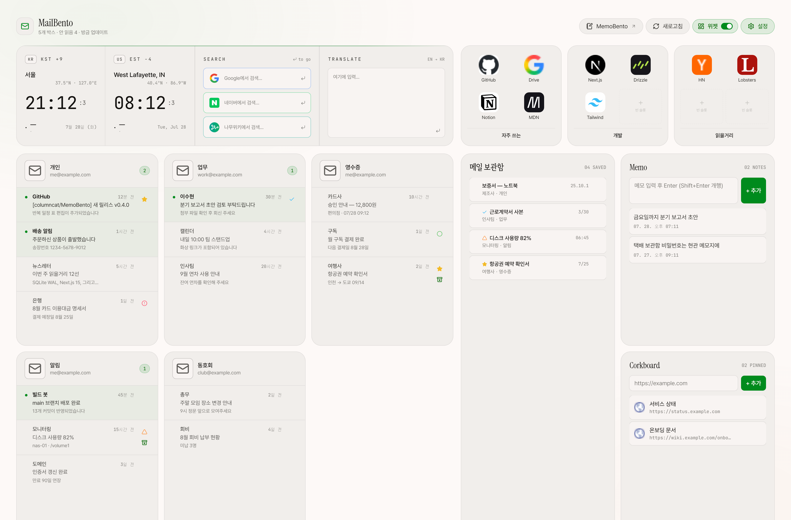

# MailBento

여러 IMAP 메일함을 한 페이지에서 동시에 보는 개인용 대시보드.



> 화면의 메일·계정·메모는 전부 예시용 더미 데이터입니다. 별표·세모를 단 메일이
> 보관함에도 함께 담겨 있는 모습입니다.
>
> 코드를 이어받는 분은 [HANDOFF.md](HANDOFF.md) 를 먼저 읽으세요 — 왜 이렇게
> 되어 있는지와 밟기 쉬운 함정을 정리해 두었습니다.

## 구조

- **Frontend**: Next.js 15 (App Router) + TypeScript + Tailwind CSS v4
- **Backend**: Next.js Route Handlers + Server Actions
- **DB**: SQLite + Drizzle ORM (`./data/mailbento.db`)
- **메일**: IMAP + 앱 비밀번호 (`imapflow`) — Naver / Daum / iCloud / Yandex /
  Fastmail / GMX 등. Gmail·Outlook도 2단계 인증 + 앱 비밀번호로 IMAP 연결 가능.
- **메일박스 뷰**: 계정 복제 + IMAP 쿼리(`folder:` / `from:` / `subject:` /
  `unseen` / `since:` …)로 폴더·검색별 박스 구성.
- **암호화**: AES-256-GCM (Node `crypto`) — IMAP 앱 비밀번호 at rest
- **보관함**: 메일 사본을 통째로 떠 두어 원본이 IMAP 에서 사라져도 열람 가능.
- **백업**: `/settings` 에서 계정·메일박스·위젯·표시설정·보관 사본을 JSON 한 파일로
  내보내기/불러오기 (전체 재현).
- **배포**: Docker (Next.js standalone output) → Synology Container Manager
- **접근**: Tailscale (인터넷 노출 없음)

## 개발 시작

```bash
npm install
cp .env.example .env.local
# .env.local 에 ENCRYPTION_KEY / (선택) AUTH_PASSWORD·AUTH_SECRET 채우기
npm run db:migrate   # (Docker/런타임에서는 부팅 시 자동 적용)
npm run dev
```

그 뒤 `/settings → 계정 추가`에서 IMAP 메일함을 등록합니다.

## 환경변수

`.env.example` 참고. 핵심:

- `ENCRYPTION_KEY` — 32바이트 base64 (`openssl rand -base64 32`). IMAP 비밀번호 암호화 키.
- `AUTH_PASSWORD` / `AUTH_SECRET` — (선택) 비밀번호 잠금. 둘 다 비우면 인증 비활성.
- `DATABASE_PATH` (기본 `./data/mailbento.db`)

## 메일박스 추가 (IMAP)

각 서비스에서 IMAP을 켜고 **앱 비밀번호**를 발급받아 `/settings`에서 등록:

- **Naver** → 환경설정 → POP3/IMAP 사용 + 앱 비밀번호
- **Daum** → 환경설정 → IMAP/SMTP 사용 (+ 2단계 인증 시 앱 비밀번호)
- **iCloud / Yandex / Fastmail / GMX** → 보안 설정에서 IMAP + 앱 비밀번호
- **Gmail / Outlook** → 2단계 인증 후 앱 비밀번호 발급 → IMAP 호스트로 등록

## Docker 배포

```bash
cp .env.example .env.local   # 값 채우기 (ENCRYPTION_KEY 등)
docker compose up -d --build
```

- 첫 부팅 시 **마이그레이션이 자동 적용**되어 빈 DB에서도 테이블이 생성됩니다.
- SQLite DB는 `./data` 볼륨에 영속화됩니다 → 이미지를 새로 빌드/재배포해도
  **계정·폴더·코크보드·메모가 유지**됩니다.
- 시크릿은 이미지에 포함되지 않고 `.env.local`(env_file)로 런타임 주입됩니다.

### 데이터/시크릿 주의

- `ENCRYPTION_KEY`를 바꾸면 저장된 OAuth 토큰을 복호화할 수 없습니다 — DB를 옮길 때
  반드시 동일한 키를 사용하세요.
- 다른 주소(NAS/Tailscale)에서 **새 계정을 추가/재인증**하려면
  `GOOGLE_REDIRECT_URI` 등 redirect URI를 그 주소로 바꾸고 각 OAuth 콘솔에도 등록해야 합니다.
  (이미 발급된 토큰으로 메일을 읽는 것은 redirect URI와 무관합니다.)

## 화면 구성

위젯을 켜면 넓은 화면에서 2×2 로 놓입니다.

```
헤더 위젯 (시계·검색·번역)          폴더
메일함 그리드                      보관함 │ Memo
                                        │ Corkboard
```

- **메일함 카드** — **머리말을 잡아 끌면** 순서가 바뀝니다. 각 줄 오른쪽에
  표식(위)과 보관(아래)이 세로로 붙습니다.
- **메일 보관함** — 왼쪽 열을 위아래로 다 씁니다. Memo·Corkboard 는 메일함 카드와
  같은 높이입니다.

## 메일 보관함

메일함 카드는 IMAP 이 주는 최신 N통을 비추는 창이라, 메일이 지워지거나 뒤로 밀리면
다시 찾을 수 없습니다. 보관함은 손으로 고른 것을 **사본째** 떠 둡니다.

- 줄이나 열람 모달의 **보관 버튼**으로 담고 뺍니다 (토글).
- 본문 HTML·텍스트·수신인까지 복사하므로 **원본이 서버에서 사라져도 그대로 열립니다.**
  열람은 IMAP 을 타지 않습니다.
- 계정을 지워도 사본은 남습니다. 목록에 `(원본 없음)` 으로 표시됩니다.
- 보관함 안에서 **끌어서 순서**를 잡습니다.
- 보관 해제는 6초 뒤에 실제로 지웁니다. 그 사이 되돌릴 수 있습니다 — 사본을 지우면
  원본이 이미 없을 수 있어 복구할 방법이 없기 때문입니다.

> **첨부와 인라인(`cid:`) 이미지는 보관하지 않습니다.** 본문은 html 2MB /
> text 500KB 에서 자릅니다.

## 위젯 설정 백업 (내보내기/불러오기)

폴더·코크보드·메모는 서버(SQLite)에 저장되어 **새 세션/기기에서도 동일하게** 보입니다.
계정 관리 페이지(`/settings`)의 **위젯 설정 백업**에서 JSON으로 내보내고 불러올 수 있어,
다른 서버로 이전하거나 백업할 때 사용합니다.

## Synology NAS 메모

- Container Manager에서 이 저장소를 clone 후 `docker compose up -d --build`,
  또는 로컬에서 빌드한 이미지를 NAS로 옮겨 실행.
- 외부 노출 없이 **Tailscale**로만 접근. 접근 주소(예: `https://mailbento.<tailnet>.ts.net`)에
  맞춰 redirect URI / 포트를 설정하세요.
